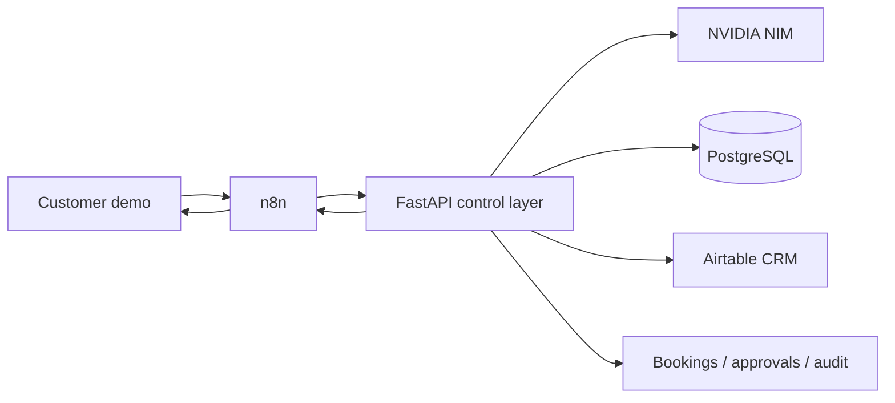

# Customer Operations AI

A reference implementation showing how customer conversations can become governed sales and service workflows instead of ending as chatbot transcripts.

The demo connects a customer messaging surface to n8n orchestration, a FastAPI control layer, NVIDIA NIM, PostgreSQL operational state, and Airtable CRM projection. The automotive data is synthetic; the workflow, idempotency, approvals, provider integrations, audit, and failure behavior are real engineering paths.

> Synthetic data. Real engineering behavior. This project is not affiliated with Toyota and does not contain real customers, inventory, WhatsApp traffic, pricing, telephony, or dealer systems.

## What this demonstrates

- customer sales and service intake through a conversational interface
- verified inventory lookup from operational state instead of model memory
- n8n orchestration without hiding policy inside visual workflow nodes
- PostgreSQL as the operational source of truth
- Airtable as an idempotent CRM projection
- typed appointment creation with replay protection
- human approval for consequential discount decisions
- safe provider and DMS failure behavior
- auditability and visible operational state

## Architecture



The model does not receive database credentials or unrestricted mutation tools. It can request a validated read-only inventory search. Bookings, discounts, CRM writes, replay handling, and other consequential actions remain behind typed application services.

## Two views

**Customer demo:** `http://localhost:8000/customer`

A clean customer-facing messaging experience. The interviewer can type arbitrary requests, browse verified synthetic inventory, request a test drive, ask for service, or request a human advisor.

**Operations dashboard:** `http://localhost:8000`

A staff-facing view focused on what needs attention: leads, appointments, approvals, service cases, recent activity, and customer context. Engineering details are intentionally kept behind a secondary Technical details drawer.

The presentation is deliberately progressive:

```text
Customer experience
        ↓
Business / operator result
        ↓
Technical proof when requested
```

## Example customer behavior

| Customer input | System behavior |
|---|---|
| `Hi` | asks for useful context without invoking the model unnecessarily |
| `I need an automatic car under 20 lakh` | searches bounded synthetic inventory |
| unsupported vehicle | explains the catalogue boundary without fabricating stock |
| warranty / mileage / finance-rate question | refuses to invent facts without an approved source |
| service or braking concern | creates a service case with deterministic urgency |
| large discount request | creates a typed approval request rather than promising a discount |
| human request | preserves context and moves to human handoff |
| prompt injection | cannot change booking, database, or commercial authority |

## Run locally

Requirements: Docker with Compose. Python 3.11+ and `uv` are only needed for host-side development commands.

```bash
git clone https://github.com/kabbersokhi-boop/customer-ops-ai.git
cd customer-ops-ai
cp .env.example .env
docker compose up -d --build
```

Open:

- Customer demo: `http://localhost:8000/customer`
- Operations dashboard: `http://localhost:8000`
- OpenAPI: `http://localhost:8000/docs`
- Health: `http://localhost:8000/health`

For the configured interview environment:

```bash
make demo-ready
make orchestration-eval
```

Useful verification commands:

```bash
make verify
make eval
make orchestration-eval
make adversarial-eval
make providers
```

## Configuration

Secrets belong only in the ignored `.env` file or a local secret store.

```dotenv
NVIDIA_NIM_API_KEY=...
NVIDIA_NIM_MODEL=z-ai/glm-5.3-flash
NVIDIA_NIM_BASE_URL=https://integrate.api.nvidia.com/v1

AIRTABLE_API_KEY=...
AIRTABLE_BASE_ID=...
AIRTABLE_ENABLED=true

ORCHESTRATION_MODE=n8n
N8N_INBOUND_WEBHOOK_URL=http://localhost:5678/webhook/customer-ops/inbound
N8N_APPOINTMENT_WEBHOOK_URL=http://localhost:5678/webhook/customer-ops/appointments
N8N_UI_BASE_URL=http://localhost:5678
```

Direct FastAPI mode remains available for offline development and safe fallback. The browser discovers its configured orchestration route through `/api/demo/config`.

## Bounded synthetic business world

The first seed creates 300 inventory records across 10 fictionalized Toyota India-style model entries and five branches. It also creates 60 synthetic customers, 60 leads, 16 initial appointments, five pending approvals, and 12 service cases.

The exact catalogue, fields, branches, colours, and explicitly unsupported areas are documented in [`docs/demo-world.md`](docs/demo-world.md).

Not present: real manufacturer/dealer data, real WhatsApp, production DMS or telephony, approved warranty-policy RAG, arbitrary specifications, live lender rates, real service history, or real customer identities.

## Verified engineering behavior

The project tests and demonstrates:

- inbound event replay protection
- appointment idempotency
- inventory recheck before booking
- safe DMS outage behavior
- CRM failure without loss of operational truth
- explicit NIM failure fallback
- validation of model tool arguments
- rejection of unauthorized model claims
- service safety routing
- human handoff
- adversarial and unsupported customer input

Detailed evidence, exact commands, historical screenshots, and provider verification notes are intentionally kept out of the main product story and live under [`docs/evidence/`](docs/evidence/) and [`docs/evals.md`](docs/evals.md).

## Trust boundaries

| Component | Owns | Does not own |
|---|---|---|
| n8n | routing, schedules, transport integration visibility | AI policy or commercial authority |
| FastAPI | typed commands, policy, grounding, idempotency | CRM-specific source of truth |
| PostgreSQL | operational state, inventory, audit, replay keys | customer-facing reasoning |
| Airtable | CRM projection | inventory, booking, or approval truth |
| NVIDIA NIM | replaceable language reasoning and read-only tool requests | database writes, bookings, discounts |
| Browser | demo customer and operator surfaces | production WhatsApp or telephony claims |

Architecture rationale is documented in [`docs/architecture.md`](docs/architecture.md), [`docs/decisions.md`](docs/decisions.md), and [`docs/threat-model.md`](docs/threat-model.md).

## Production gaps

This is a reference system, not a production-ready claim. A real rollout still needs identity-backed RBAC, signed channel webhooks, rate limiting, managed secrets, migrations, queue/outbox-backed delivery, telemetry export, formal PII retention controls, production messaging/DMS adapters, concurrency/load testing, and security review.

## Repository map

```text
app/
  main.py                   HTTP and demo-page boundary
  demo_world.py             bounded synthetic-world definition
  providers/                NVIDIA NIM and Airtable adapters
  services/                 policy, grounding, idempotency, orchestration
  static/customer.html      customer-facing demo
  static/index.html         operator dashboard
n8n/                        workflow exports
scripts/                    seed, preflight, verification, evals
tests/                      policy, failure, replay and adversarial coverage
docs/                       architecture, decisions, demo scope and evidence
```
