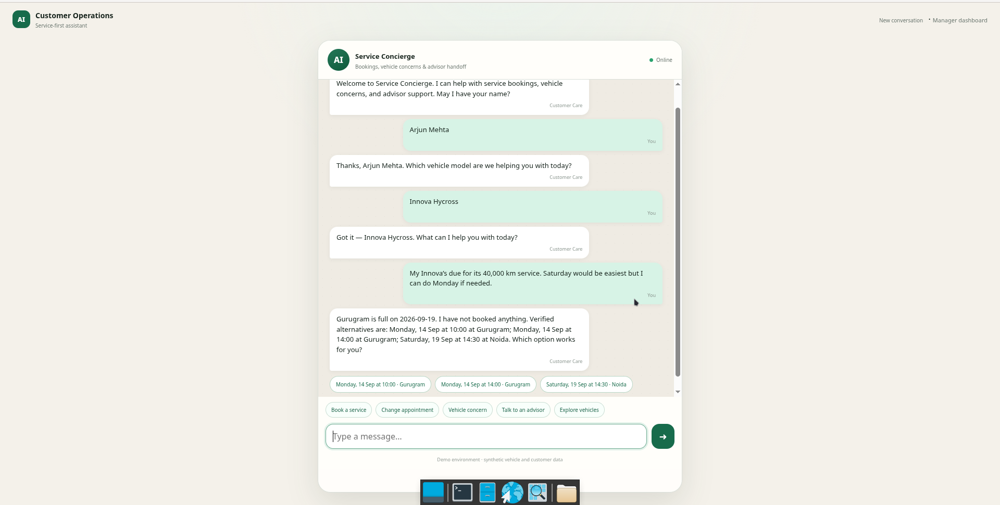
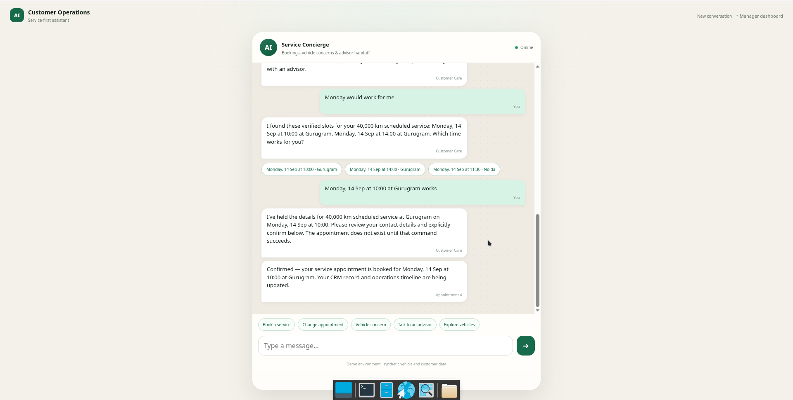
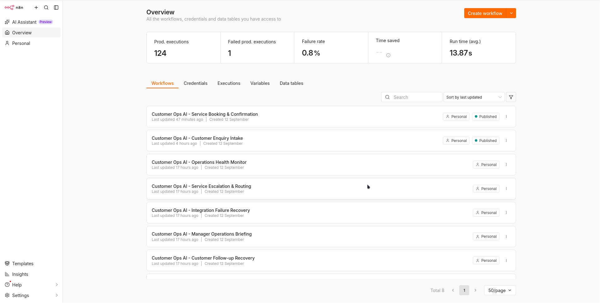
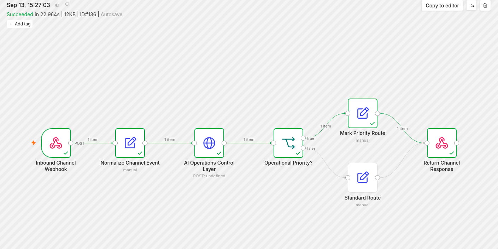
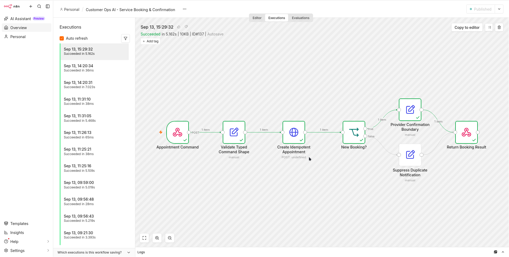
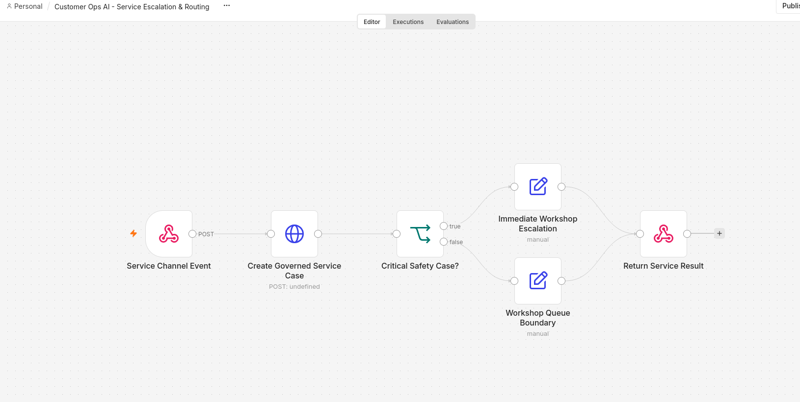
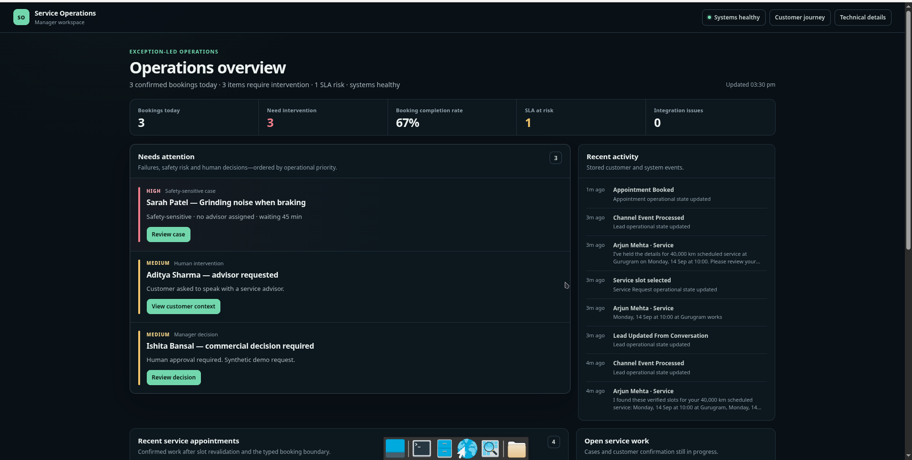
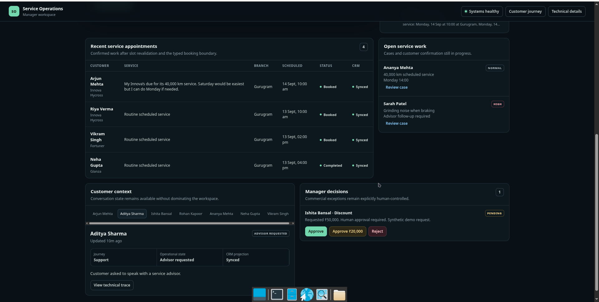
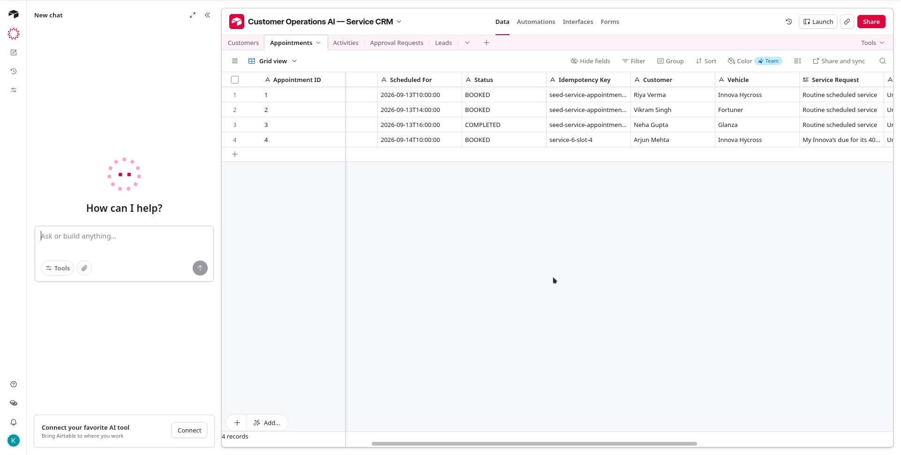

# Customer Operations AI

**A governed automotive customer-operations system.** Natural-language requests become grounded, validated, and transactional business actions. The chatbot is the interface; it is not the authority.

This personal reference implementation was built specifically as a capability demonstration for an **AI Automation & Integration Manager** opportunity at **The Sachdev Group (TSG Automotive)**. It is not commissioned work, a TSG deployment, or a claim of access to TSG systems or data.

> **Prototype constraint:** built in under 24 hours with zero paid API spend. The prototype uses synthetic dealership data, but exercises real PostgreSQL transactions, NVIDIA NIM integration, Airtable API calls, n8n executions, validation, idempotency, and failure semantics.

**Repository verification:** 61 tests collected and passed · 8 credential-free n8n exports validated · Ruff passed · history-aware secret scan passed · Docker image build passed.

## What was built

The system turns a customer request into an accountable operational outcome:

~~~text
customer conversation
  -> normalized event
  -> grounded service availability
  -> explicit confirmation
  -> typed booking command
  -> PostgreSQL transaction
  -> CRM projection
  -> manager visibility, audit, and safe recovery
~~~

The responsibility split is deliberate:

- **NVIDIA NIM** interprets bounded language and produces responses within a constrained role.
- **Python / FastAPI** validates typed commands, applies business rules, enforces confirmation boundaries, and controls retries.
- **PostgreSQL** owns operational truth: customer state, slots, appointments, recovery work, and audit records.
- **n8n** normalizes events, routes workflows, exposes executions, and isolates provider boundaries.
- **Airtable** receives a business-facing CRM projection for this prototype. It does not authorize bookings.
- **Manager workspace** shows operational state and supports intervention.

The model cannot authoritatively invent availability, booking success, price, approval, or system state.

## Captured service journey

The screenshots record a synthetic walkthrough for **Arjun Mehta** and an **Innova Hycross**. They demonstrate the system behavior, not a production dealership environment.

1. The customer requests a 40,000 km service. Saturday is the primary preference; Monday is the fallback.
2. The control layer reads PostgreSQL-backed service slots. Gurugram is full on Saturday, so it offers only verified alternatives: Monday 10:00 and 14:00 in Gurugram, or Saturday 14:30 in Noida.
3. An unrelated question does not change the active service state. The conversation remains inside the service boundary.
4. The customer selects Monday at 10:00. The interface presents the selected slot but does not create an appointment.
5. The customer explicitly confirms. The booking command revalidates capacity inside the transaction and uses one idempotency key.
6. The system creates one appointment, updates the CRM projection, and exposes the result to operations.

The confirmation screen is an authority boundary. A conversational offer is not a reservation, and a response is not a booking until the typed command succeeds.

## Architecture and authority boundaries

~~~mermaid
flowchart LR
    C[Customer channel] --> N[n8n orchestration]
    N --> A[FastAPI / Python control layer]
    A --> L[NVIDIA NIM bounded interpretation]
    A --> P[(PostgreSQL operational truth)]
    A --> B[Typed booking and recovery]
    B --> N
    N --> R[CRM or DMS adapter]
    P --> M[Manager workspace]
    R --> M
    N --> C
~~~

| Component | Owns | Does not own |
|---|---|---|
| NVIDIA NIM | bounded language interpretation and approved read-only reasoning | availability, booking success, approval, price, or data mutation |
| Python / FastAPI | validation, state transitions, confirmation, authorization, provider guards, and retry behavior | CRM transaction authority |
| PostgreSQL | customers, slots, appointments, recovery work, replay keys, and audit records | conversational presentation |
| n8n | triggers, webhooks, routing, schedules, execution visibility, and provider boundaries | business policy or arbitrary business authority |
| Airtable | prototype CRM projection | booking validity or operational source of truth |

**Control rule:** n8n decides when and where a workflow runs. Python decides whether and what an action means. PostgreSQL stores the result. CRM systems receive projections. NVIDIA NIM operates within those boundaries.

## n8n automation estate

The repository contains eight credential-free n8n exports. The workflows make orchestration visible without moving domain policy into low-code nodes.

| Workflow | Purpose and important control |
|---|---|
| **Customer Enquiry Intake** | Receives a channel event, normalizes it, invokes the governed control layer, sets priority routing, and returns the typed response. |
| **Service Booking & Confirmation** | Validates the booking shape, creates one idempotent appointment, identifies a new booking versus a replay, and gates provider confirmation. |
| **Service Escalation & Routing** | Creates a governed service case and sends critical safety cases to an immediate workshop escalation path. |
| **Manager Approval Decision** | Sends a typed human decision to the API, audits it, and stops at an approved message boundary. |
| **Customer Follow-up Recovery** | Finds stale high-intent leads on a schedule and queues idempotent follow-up work without sending an unapproved message. |
| **Integration Failure Recovery** | Classifies provider failures, waits for bounded backoff, and requires replay through an idempotent entry point. |
| **Manager Operations Briefing** | Reads grounded operations metrics, prepares the manager payload, and exposes a delivery adapter boundary. |
| **Operations Health Monitor** | Checks control-layer health, detects safe fallback, and prepares an operational alert when verification is unavailable. |

### Inbound normalization and control path

The successful **Customer Enquiry Intake** execution shows the actual control path. **Inbound Channel Webhook** accepts the request. **Normalize Channel Event** creates the typed envelope and preserves conversation continuity. **AI Operations Control Layer** calls FastAPI with a 120-second provider budget. **Operational Priority?** selects **Mark Priority Route** or **Standard Route**; both preserve the governed response and execution metadata.

### Booking and idempotency path

**Appointment Command** begins the booking workflow. **Validate Typed Command Shape** forwards only required command fields. **Create Idempotent Appointment** calls the API. **New Booking?** branches on the **created** result, not merely on a confirmed response. **Provider Confirmation Boundary** permits one downstream confirmation only after a new appointment exists. **Suppress Duplicate Notification** handles replay and recovery-pending results without another customer effect.

### Safety routing and provider recovery

**Service Channel Event** calls **Create Governed Service Case**. **Critical Safety Case?** separates **Immediate Workshop Escalation** from the normal **Workshop Queue Boundary**. The workflow does not diagnose a vehicle or fabricate an appointment. The separate **Integration Failure Recovery** workflow records provider-failure context, applies **Bounded Backoff**, and sends only an operations handoff; any retry must reuse the original idempotency key.

## Manager operations workspace

The manager interface is exception-led. It is not a database viewer. It prioritizes confirmed bookings, intervention count, booking completion rate, SLA risk, integration issues, safety-sensitive cases, human handoffs, commercial decisions, and recent operational activity.

The lower workspace exposes recent service appointments, open service work, customer context, manager decisions, CRM state, and technical trace. This permits an operator to investigate and intervene without giving privileged authority to the chat interface.

## CRM projection: Airtable is replaceable

The Airtable Appointments table is evidence of a business-facing projection after the booking transaction. Airtable is a **lightweight CRM adapter for this prototype**, not an enterprise CRM and not the source of operational truth.

The same adapter boundary can connect **HubSpot, Zoho, Salesforce, an in-house CRM, or a dealership DMS** in production. Replacing the adapter does not move transaction authority out of Python and PostgreSQL. The appointment projection includes customer, vehicle, service request, operational status, next action, and an idempotency key; FastAPI updates PostgreSQL first and records CRM failures separately.

## Deterministic synthetic operating world

The dealership world is intentionally synthetic and deterministic. It allows business constraints, failure conditions, and customer journeys to be reset, replayed, and regression-tested without TSG data or real customer data.

- **app/demo_world.py** defines the bounded catalog and operational baseline; the seed uses fixed random seed 42.
- The world includes 300 synthetic inventory rows across ten models, five synthetic branches, eight seeded customers, five service requests, three appointments, and one pending approval.
- The service fixture keeps Gurugram full on Saturday, makes Monday 10:00 and 14:00 available in Gurugram, and makes Saturday 14:30 available in Noida.
- **make demo-reset** rebuilds the guarded local baseline and can snapshot only application-owned Airtable tables before cleanup.

Synthetic data is test infrastructure. It is not presented as dealership data, production demand, or evidence of customer performance.

## Failure and safety semantics

**Safety-sensitive service concerns:** a grinding-brake report becomes a governed service case with critical priority. The system avoids diagnosis, blocks routine auto-booking, and routes the case for workshop attention.

**Scheduler or provider uncertainty:** a timeout never becomes a false booking confirmation. The requested slot and contact payload are preserved as recovery work. No appointment is created. A manager retry uses the same idempotency key; once it succeeds, later retries return the existing appointment.

**CRM failure:** Airtable failure does not invalidate the PostgreSQL transaction. The CRM sync state is recorded for operational follow-up.

## Production extension: same control layer, new adapters

The following are production extensions, not current features:

- WhatsApp Business API can use the existing normalized channel contract.
- Voice AI and telephony can use the same intent, validation, slot-selection, and explicit-confirmation controls.
- A production CRM or dealer-management system can replace the Airtable adapter.
- Real workshop capacity, advisor calendars, bay skills, and scheduling providers can replace deterministic service slots.
- Signed webhooks, RBAC, managed secrets, queue/outbox delivery, observability, PII controls, load testing, and incident runbooks are required before production use.

WhatsApp and voice change the channel interface. They do not change the authority model.

## Verification and local run

The CI workflow compiles source, runs Ruff, validates all workflow exports, scans tracked source and Git history for secrets, runs the test suite, and builds the container image on pushes and pull requests.

~~~bash
git clone https://github.com/kabbersokhi-boop/customer-ops-ai.git
cd customer-ops-ai
cp .env.example .env
docker compose up -d --build

make demo-ready
make demo-reset
make verify
make eval
make orchestration-eval
make adversarial-eval
make providers
docker build .
~~~

**make verify** runs linting, workflow validation, the history-aware secret scan, and tests. The live provider and orchestration commands require the corresponding local credentials and published n8n webhooks.

## Repository map

~~~text
app/
  demo_world.py                   deterministic synthetic operating world
  providers/nim.py                NVIDIA NIM provider boundary
  providers/airtable.py           Airtable CRM adapter
  services/agent.py               bounded conversation routing
  services/service_scheduling.py  grounded service availability and state
  services/appointments.py        revalidation, transactions, and idempotency
  services/ops.py                 manager metrics and intervention state
  static/customer.html            customer service journey
  static/index.html               manager operations workspace
n8n/                              eight workflow exports
scripts/reset_demo.py             guarded database and CRM reset
tests/                            behavior, safety, replay, and integration contracts
docs/evidence/final/              original final walkthrough screenshots
~~~

See [docs/evidence/README.md](docs/evidence/README.md) for screenshot provenance and capture notes.
