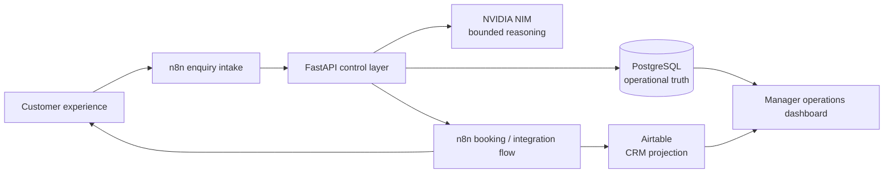

# Customer Operations AI

An AI-enabled customer operations system that turns dealership conversations into governed service bookings, CRM updates, follow-up work, and recoverable operational workflows.

The domain and data are synthetic. The control flow, PostgreSQL transactions, idempotency, NVIDIA NIM integration, Airtable projection, n8n orchestration, audit trail, and failure behavior are real implementation paths.

> This is a reference customer-operations platform, not a Toyota product and not a production dealership system.

## Why this project exists

A normal chatbot ends with text. This system can carry a customer request through a bounded business process while keeping authority in structured systems:

```text
customer request → intent and context → grounded availability → explicit confirmation
→ typed booking command → PostgreSQL commit → Airtable projection → manager visibility
```

If an integration fails, the system does not turn uncertainty into a reassuring sentence. It preserves the requested action as operational work and makes retry safe.

## Five-minute demo

1. Open `http://localhost:8000/customer`, enter a name, and choose **Book a service**.
2. Ask: `My car needs its 40,000 km service. Can I come Saturday?`
3. The system checks PostgreSQL-backed service slots. Gurugram is full and only verified alternatives are offered.
4. Reply: `Actually, Monday works.` Then choose `10:00`.
5. Review the proposed branch, time, and contact details. No appointment exists yet.
6. Select **Confirm service appointment**. The API rechecks capacity inside the booking transaction, applies one idempotency key, persists the customer contact, creates the appointment, and projects it to Airtable.
7. Open `http://localhost:8000`. The manager dashboard shows the customer, confirmed service appointment, CRM state, operational metrics, and a readable technical trace.

A secondary safety scenario is equally important: `My brakes are making a grinding noise.` The system avoids diagnosis, pauses routine auto-booking, creates a priority service case, and surfaces it under **Needs your attention**.

## More than a chatbot

- **Grounded availability:** service slots and inventory come from PostgreSQL, never model memory.
- **Explicit authority:** NVIDIA NIM can interpret language and request allow-listed reads; it cannot confirm slots, mutate data, approve discounts, or declare success.
- **Typed commands:** consequential actions cross validated Pydantic/FastAPI boundaries.
- **Transaction safety:** service capacity is locked and revalidated immediately before commit.
- **Idempotency:** channel receipts, appointments, approvals, and recovery retries suppress duplicate effects.
- **Recoverable failure:** scheduler timeout creates a durable work item without creating or claiming a booking.
- **Human escalation:** safety-sensitive service concerns and commercial exceptions remain visible human work.
- **Operational visibility:** the manager view emphasizes intervention, SLA risk, confirmation state, and integration health—not database-row vanity counts.

## Architecture



| Component | Owns | Explicitly does not own |
|---|---|---|
| NVIDIA NIM | language understanding, bounded response generation, allow-listed read tool selection | availability, identity, prices, booking success, approvals, mutation |
| FastAPI / Python | business meaning, validation, confirmation boundary, safe fallback, retries | CRM as operational truth |
| PostgreSQL | customers, service slots, appointments, recovery work, audit and replay keys | conversational presentation |
| n8n | when/where orchestration, webhooks, schedules, routing and provider boundaries | booking policy or arbitrary business logic |
| Airtable | business-facing CRM projection | booking validity or transaction authority |
| Browser | customer and manager experiences | privileged arbitrary HTTP, SQL, or model tools |

The deliberate boundary is: **n8n decides when and where; Python decides whether and what an action means; PostgreSQL stores truth; Airtable projects it; NIM reasons within constraints.**

## Failure behavior

The controlled demo proves that `provider timeout != booking confirmed`:

```text
explicit confirmation
→ scheduler unavailable
→ zero appointment rows created
→ requested slot and contact payload preserved
→ recovery work item visible to manager
→ same idempotency key retried
→ one appointment created after recovery
→ subsequent retries return the same appointment
```

The simulation is disabled unless `DEMO_CONTROLS_ENABLED=true` and `APP_ENV` is `development`, `demo`, or `test`. The API and database are bound to the local Compose environment; there is no public destructive reset endpoint.

## Demo interfaces

- Customer journey: `http://localhost:8000/customer`
- Manager operations dashboard: `http://localhost:8000`
- n8n: `http://localhost:5678`
- OpenAPI: `http://localhost:8000/docs`
- Health/readiness: `http://localhost:8000/health` and `http://localhost:8000/ready`

Technical details stay behind progressive disclosure in the manager dashboard: request path, n8n execution link, CRM sync result, audit events, provider state, and idempotency/recovery proof.

## Run locally

Requirements: Docker with Compose. Python 3.11+ and `uv` are needed only for host-side development checks.

```bash
git clone https://github.com/kabbersokhi-boop/customer-ops-ai.git
cd customer-ops-ai
git switch presentation-reset-clean-demo
cp .env.example .env
docker compose up -d --build
```

Add local provider credentials to `.env`; never commit that file. For the interview environment, use:

```dotenv
APP_ENV=demo
DEMO_CONTROLS_ENABLED=true
NVIDIA_NIM_API_KEY=...
AIRTABLE_API_KEY=...
AIRTABLE_BASE_ID=...
AIRTABLE_ENABLED=true
ORCHESTRATION_MODE=n8n
N8N_INBOUND_WEBHOOK_URL=http://localhost:5678/webhook/customer-ops/inbound
N8N_APPOINTMENT_WEBHOOK_URL=http://localhost:5678/webhook/customer-ops/appointments
N8N_UI_BASE_URL=http://localhost:5678
```

Prepare the live demo:

```bash
make demo-ready
```

Reset accumulated local demo and Airtable projection data to the guarded baseline:

```bash
make demo-reset
```

`make demo-reset` runs only when the explicit demo controls are enabled, refuses non-local database hosts, preserves credentials/configuration, writes an ignored Airtable snapshot to `.demo-backups/`, rebuilds the application schema, and seeds a small deterministic service-operations world. It only clears records in the five configured application-owned Airtable tables; unrelated tables are untouched.

## Verification

```bash
make verify                 # lint, workflow validation, history-aware secret scan, tests
make eval                   # bounded customer behavior evaluation
make orchestration-eval     # n8n browser-to-control-layer path
make adversarial-eval       # prompt injection and authority boundary cases
make providers              # configured NVIDIA NIM and Airtable checks
docker build .              # production image build
```

CI repeats compilation, linting, workflow validation, secret scanning, tests, and container build on every push and pull request.

## Synthetic scope

Synthetic:

- dealership identity, branches, customers, vehicles, registrations, inventory, prices, service slots, appointments, and messages
- baseline operational workload and KPI values derived from that stored workload
- provider delivery adapters at the final n8n boundary

Real engineering behavior:

- NVIDIA NIM HTTP integration and guarded fallback
- PostgreSQL persistence and transaction boundaries
- slot capacity checks and concurrency-oriented row locking
- typed FastAPI commands and Pydantic validation
- idempotent replay and duplicate suppression
- Airtable API upserts and CRM failure recording
- n8n webhook/schedule orchestration and execution metadata
- safe recovery work and operator retry

The current seed is intentionally small: eight customers, three service appointments, five service requests, one pending approval, one safety case, and secondary sales/handoff examples. The 300-row synthetic inventory remains available as proof of reuse, but it is not the primary story.

## Production gaps

A real deployment would still require identity-backed RBAC, signed inbound webhooks, rate limiting, managed migrations, an outbox/queue for guaranteed provider delivery, distributed locking or database-specific concurrency tests at scale, observability export, formal PII retention/deletion controls, managed secrets, production DMS/scheduler/WhatsApp adapters, availability calendars with advisor/bay skills, load testing, incident runbooks, and security/privacy review.

Those gaps are deliberate. The portfolio goal is to demonstrate the control architecture and failure semantics without pretending a synthetic dealership is production-ready.

## Repository map

```text
app/
  main.py                       HTTP and demo-page boundary
  models/                       operational entities and recovery state
  providers/                    NVIDIA NIM and Airtable adapters
  services/service_scheduling.py grounded availability and conversation state
  services/appointments.py      validation, recheck, transaction and retry semantics
  services/ops.py               manager metrics and attention aggregation
  static/customer.html          customer service journey
  static/index.html             manager operations dashboard
n8n/                            eight stable workflow exports
scripts/reset_demo.py           guarded database/CRM reset with Airtable snapshot
scripts/                        seed, preflight, verification and evaluations
tests/                          behavior, failure, replay and integration contracts
docs/                           architecture, demo world, threat model and interview guide
```
