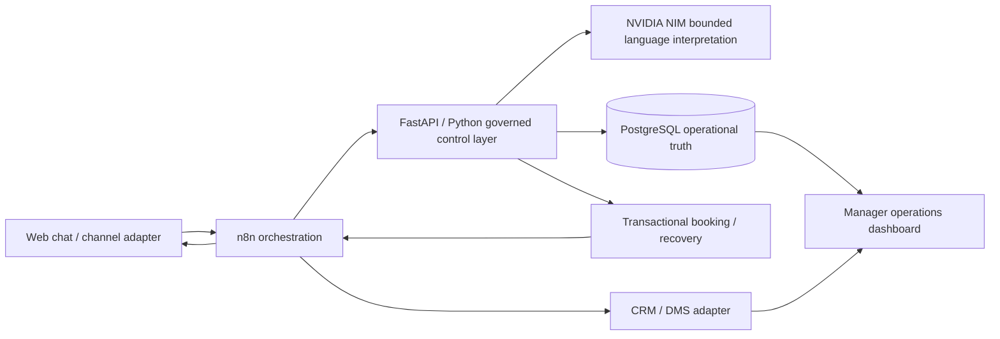

# Customer Operations AI

**Governed automotive service automation built to show how conversational AI can safely complete real business workflows.**

This is a personal reference implementation built specifically as a capability demonstration for **The Sachdev Group (TSG Automotive)** and the kind of AI Automation & Integration Manager work the role requires: AI-assisted customer journeys, workflow automation, API integration, CRM projection, operational controls, and human escalation.

> **Prototype constraint:** built in under 24 hours with zero paid API spend. The goal was not to imitate a production dealership stack; it was to prove the architecture, integration patterns, Python implementation depth, and operational control model needed to connect real channels and systems later.

**Current verified build:** 61 tests passed · 8 n8n workflow exports validated · Ruff passed · secret scan passed · Docker build passed

**Synthetic data, real engineering behavior.** No TSG internal systems, real customer records, production WhatsApp traffic, telephony, live dealer data, or private company data are used here. Customer identities, vehicles, registrations, inventory, slot capacity, appointments, and operating history are synthetic. The PostgreSQL transactions, API boundaries, NVIDIA NIM integration, Airtable API projection, n8n orchestration, idempotency, and failure semantics are implemented as real software paths.


## What this system proves

A normal chatbot ends with text. This system can carry a customer request through a bounded business process while keeping authority in deterministic software:

```text
customer conversation
    -> n8n channel orchestration
    -> FastAPI / Python control layer
    -> bounded NVIDIA NIM interpretation
    -> PostgreSQL facts and state
    -> explicit customer confirmation
    -> transactional booking
    -> CRM projection
    -> manager visibility and recovery
```

The design rule is simple:

**NIM interprets. Python validates and authorizes. PostgreSQL is operational truth. n8n orchestrates. CRM receives a business-facing projection.**

That boundary matters because the model must never authoritatively invent availability, booking success, inventory, price, approval, or system state.

## Final live-verified service journey

The final walkthrough used a synthetic customer, **Arjun Mehta**, and an **Innova Hycross**.

1. The assistant collected customer name and vehicle context before opening the service flow.
2. The customer said: `My Innova's due for its 40,000 km service. Saturday would be easiest but I can do Monday if needed.`
3. The system retained **Saturday as the primary preference** and **Monday as fallback**.
4. PostgreSQL-backed availability showed Gurugram full on Saturday and offered only verified alternatives: Monday 10:00 / 14:00 in Gurugram and Saturday 14:30 in Noida.
5. An unrelated question during the active service conversation was refused without mutating booking state.
6. The customer changed intent naturally with `Actually Monday.` and selected 10:00.
7. The UI required explicit confirmation. Capacity was revalidated before commit.
8. One appointment was created transactionally and projected to Airtable.
9. The manager dashboard showed the correct customer, vehicle, booking and CRM state.
10. n8n showed the successful orchestration path through the booking boundary.

Duplicate confirmation uses a stable idempotency key, so replay returns the existing booking rather than creating another business effect.

## Operations visibility

The manager workspace is intentionally exception-led rather than a database viewer. It surfaces KPIs, work needing intervention, recent activity, service appointments, open service work, customer context, manager decisions, and technical trace details.


This is important to the project story: the customer-facing assistant is only the interface. The actual product is a governed customer-operations system.

## n8n automation estate

The repository contains **eight credential-free n8n workflow exports**. Business policy stays in Python; n8n owns triggers, routing, schedules, orchestration visibility, provider boundaries, and recovery plumbing.

| Workflow | Business purpose |
|---|---|
| **Customer Enquiry Intake** | Normalizes inbound channel payloads, invokes the control layer, classifies operational priority, and returns a typed response |
| **Service Booking & Confirmation** | Validates the typed booking command, creates the appointment idempotently, distinguishes new bookings from replay, and suppresses duplicate downstream notification |
| **Service Escalation & Routing** | Creates a governed service case and separates critical safety escalation from a normal workshop queue boundary |
| **Manager Approval Decision** | Applies a typed human commercial decision while preserving the delivery boundary |
| **Customer Follow-up Recovery** | Finds stale high-intent leads and queues recoverable follow-up work |
| **Integration Failure Recovery** | Classifies provider errors, applies bounded backoff, and preserves safe retry semantics |
| **Manager Operations Briefing** | Pulls grounded operational metrics and prepares a manager-facing briefing boundary |
| **Operations Health Monitor** | Detects safe fallback / integration state and prepares an operational alert |

### Inbound orchestration

The live inbound execution visibly follows:

`Inbound Channel Webhook -> Normalize Channel Event -> AI Operations Control Layer -> Operational Priority? -> Mark Priority Route / Standard Route -> Return Channel Response`


### Safety routing

The service escalation workflow makes a safety-sensitive concern explicit operational work:

`Service Channel Event -> Create Governed Service Case -> Critical Safety Case? -> Immediate Workshop Escalation / Workshop Queue Boundary -> Return Service Result`


### Booking boundary

The booking workflow is deliberately typed and replay-safe:

`Appointment Command -> Validate Typed Command Shape -> Create Idempotent Appointment -> New Booking? -> Provider Confirmation Boundary / Suppress Duplicate Notification -> Return Booking Result`

The `New Booking?` branch checks whether the booking was **created**, not merely whether a response is confirmed. An idempotent replay can be confirmed while still being `created=false`, which is why duplicate notification remains suppressed.

## Architecture and responsibility split



| Component | Owns | Explicitly does not own |
|---|---|---|
| **NVIDIA NIM** | bounded language interpretation and allowed read-only reasoning | availability, booking success, pricing authority, approvals, data mutation |
| **FastAPI / Python** | business meaning, validation, state transitions, confirmation boundary, retry semantics, provider guards | CRM as source of truth |
| **PostgreSQL** | customers, slots, appointments, recovery work, audit and replay keys | conversational presentation |
| **n8n** | triggers, routing, schedules, webhooks, integration boundaries and visible execution | booking policy or arbitrary business authority |
| **Airtable** | business-facing CRM projection for the prototype | booking validity or transaction authority |
| **Browser** | customer and manager experiences | privileged SQL, credentials, unrestricted model tools |

## Airtable is a replaceable CRM adapter

Airtable is intentionally used as a **lightweight CRM projection**, not as the authoritative business system.

In a production TSG environment the same adapter boundary can be replaced with **HubSpot, Zoho, Salesforce, an in-house CRM, or a dealer-management-system integration** without moving booking authority out of the Python/PostgreSQL control layer.

That separation is deliberate: changing the CRM should be an integration task, not a rewrite of business logic.

## Synthetic dealership world, by design

The demo uses a deterministic synthetic operating environment so the same scenarios can be reset, replayed, regression-tested, and demonstrated without exposing real customer or dealer information.

The machine-readable world is defined in `app/demo_world.py` and seeded with a fixed random seed (`42`). It contains:

- **300 synthetic inventory rows**, exactly 30 units for each of 10 models
- **5 synthetic branches:** Gurugram, New Delhi, Noida, Faridabad, Ghaziabad
- structured vehicle variant, transmission, fuel, colour, branch, price, availability, test-drive and delivery fields
- **8 seeded customers**
- **5 service requests**, including a safety-sensitive case
- **3 seeded service appointments**
- **1 awaiting-confirmation case**
- **1 pending commercial approval**
- integration-state flags and secondary sales / handoff examples

The interview fixture deliberately keeps Gurugram full on Saturday, available Monday at 10:00 and 14:00, and Noida available Saturday at 14:30. That gives the conversation a repeatable business constraint against which language interpretation can be tested.

Synthetic data is not presented as production evidence. It is test infrastructure for proving the control flow.

## Safety and failure semantics

Two non-happy paths shape the architecture:

**Safety-sensitive service concern**

`brakes are grinding -> no diagnosis -> governed service case -> priority route -> manager visibility`

**Scheduler / provider uncertainty**

`explicit confirmation -> provider timeout -> no fake booking success -> details preserved -> recovery work item -> same idempotency key retried -> one booking after recovery`

The key invariant is: **uncertainty never becomes a reassuring but unverified customer claim.**

## Production extension

The prototype is intentionally narrow in infrastructure, not in architecture. With approved production credentials, the same boundaries can extend to:

- **WhatsApp Business API** as another inbound / outbound channel adapter
- **Voice AI and telephony** wrapping the same intent, validation, slot and confirmation contracts
- **CRM / DMS integration** through HubSpot, Zoho, Salesforce, an in-house CRM, or dealership systems
- real workshop capacity, advisor skills, bays and scheduling calendars
- signed webhooks, enterprise identity / RBAC, managed secrets and formal PII controls
- queue / outbox-backed delivery, observability export, load testing and incident runbooks

Voice or WhatsApp would change the interface, not the authority model.

## Verification

At the current final commit, CI verifies:

```text
Compile                 passed
Ruff                    passed
n8n workflow exports     8 validated
Secret / history scan    passed
Tests                    61 passed
Docker image build       passed
```

NVIDIA NIM is configured locally through the provider adapter in `app/providers/nim.py`; the model has a bounded language role and does not own transactional authority.

## Run locally

Requirements: Docker with Compose. Python 3.11+ and `uv` are useful for host-side development checks.

```bash
git clone https://github.com/kabbersokhi-boop/customer-ops-ai.git
cd customer-ops-ai
cp .env.example .env
docker compose up -d --build
```

For the controlled demo environment:

```bash
make demo-ready
make demo-reset
```

Useful verification commands:

```bash
make verify
make eval
make orchestration-eval
make adversarial-eval
make providers
docker build .
```

## Scope

This repository is a portfolio reference implementation, not a Toyota product, not a TSG production deployment, and not a claim that synthetic tests establish production readiness.

A real rollout still requires production identity, security and privacy review, managed infrastructure, signed channel webhooks, production DMS / scheduler / messaging adapters, queue-backed delivery, formal observability, load testing, operational ownership and incident procedures.

## Repository map

```text
app/
  main.py                         HTTP and demo-page boundary
  demo_world.py                   deterministic synthetic operating world
  providers/nim.py                NVIDIA NIM provider boundary
  providers/                      CRM / provider adapters
  services/service_scheduling.py  grounded service availability and state
  services/appointments.py        revalidation, transaction and idempotency
  services/agent.py               bounded conversation routing
  services/ops.py                 manager metrics and intervention state
  static/customer.html            customer journey
  static/index.html               manager operations workspace
n8n/                              eight workflow exports
scripts/reset_demo.py             guarded DB / CRM reset
scripts/                          verification, eval and provider checks
tests/                            behavior, failure and replay contracts
docs/                             architecture, demo world and evidence
```

See [`docs/evidence/README.md`](docs/evidence/README.md) for screenshot provenance and the final live-walkthrough evidence set.
