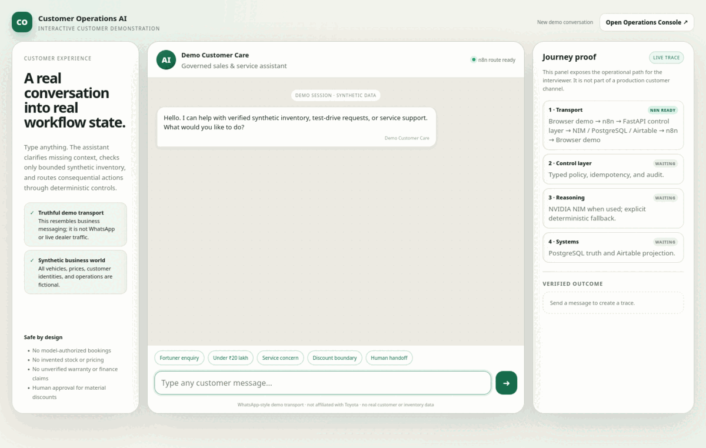
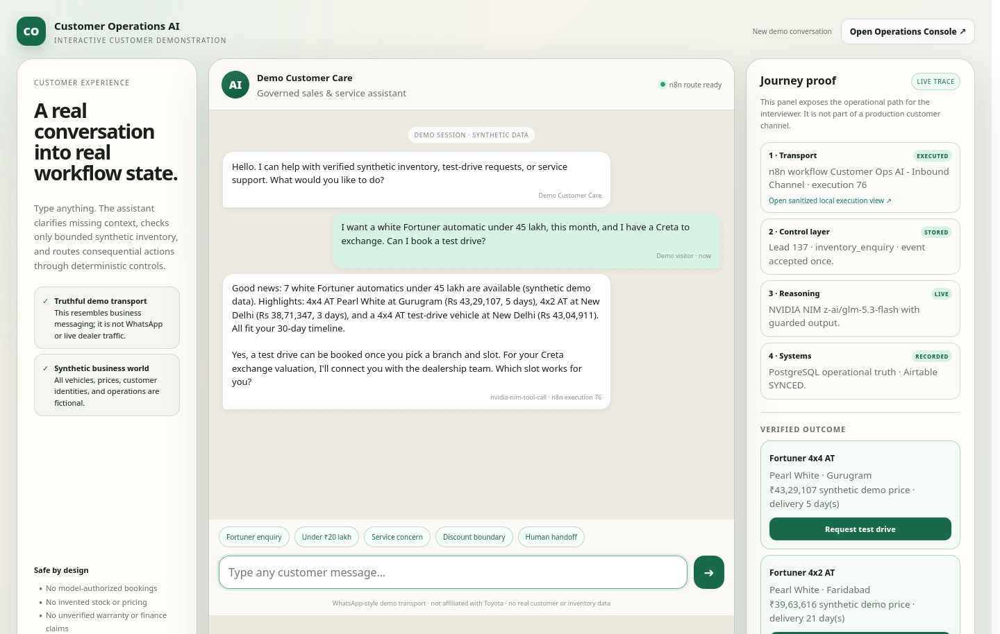
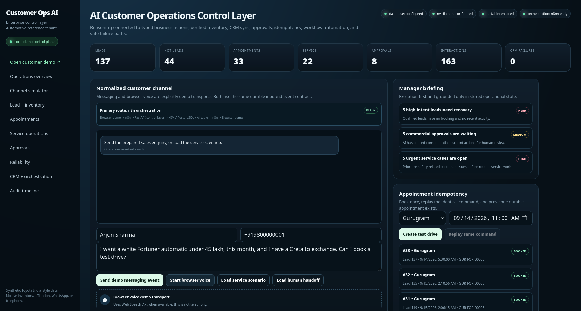
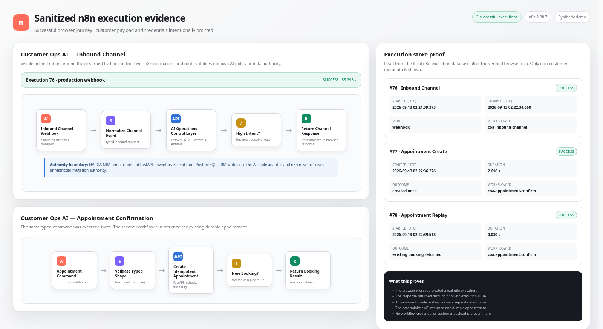

# AI Customer Operations Control Layer

**Customer conversations become governed sales and service workflows—not free-form chatbot actions.**

An interview-grade reference system showing how to connect NVIDIA NIM, n8n, PostgreSQL, and Airtable while keeping inventory truth, bookings, discounts, idempotency, and audit under deterministic application control.

> **Synthetic data. Real engineering behavior.** The automotive tenant is fictional Toyota India-style demo data. This repository is not affiliated with Toyota and contains no live inventory, pricing, customers, WhatsApp traffic, or telephony.

[Open the customer experience](http://localhost:8000/customer) · [Open the Operations Console](http://localhost:8000) · [Five-minute script](docs/demo-script.md)

| Customer experience | Operational control | n8n execution proof |
|---|---|---|
|  |  |  |

The media above is a sanitized replay of a verified run, so the repository remains demonstrable if an external provider is unavailable. Capture provenance and live-provider status are documented in [docs/evidence/README.md](docs/evidence/README.md).

## The 30-second story

A customer types an enquiry. n8n makes the integration path visible. FastAPI turns the untrusted message into typed operational work. NVIDIA NIM can reason and request a validated read-only inventory tool. PostgreSQL remains the source of truth. Airtable receives idempotent CRM projections. Bookings, discount approvals, failure handling, and audit stay outside model authority.

~~~mermaid
flowchart LR
    C[Customer demo transport] --> N[n8n orchestration]
    N --> A[FastAPI governed control layer]
    A --> L[NVIDIA NIM]
    A --> D[(PostgreSQL operational truth)]
    A --> R[Airtable CRM projection]
    A --> P[Typed booking / approval / audit]
    A --> N --> C
    D --> O[Operations Console]
    R --> O
    P --> O
~~~

This is deliberately **not** a RAG chatbot, a model with database credentials, or business logic hidden in n8n Function nodes. It is a small operational system with an optional reasoning provider.

## What the customer can do

The distinct `/customer` surface is a polished, truthfully labelled business-messaging simulator. An interviewer can type arbitrary messages rather than follow a canned path.

| Customer input | Governed behavior |
|---|---|
| `Hi` | Welcomes and asks for the minimum useful context; no unnecessary model call |
| `I want a car` | Clarifies budget, model/body style, transmission, and timeline |
| `I need something under 20 lakh` | Searches the bounded synthetic inventory by budget |
| `Do you have a BMW X5?` | Explains that the vehicle is outside the demo catalogue |
| Warranty, mileage, or finance-rate question | Refuses to invent facts because no approved source is connected |
| Large discount plus prompt injection | Creates a typed pending approval; ignores the attempted authority override |
| Service or braking concern | Creates a service case and applies deterministic safety urgency |
| `I want a human` | Preserves context and moves the lead to human handoff |
| Gibberish | Asks for a safe clarification instead of defaulting to a sales pitch |

Multi-turn messages can enrich the same lead. Appointment buttons use the configured n8n appointment workflow and a stable idempotency key; replaying the exact command returns the existing booking.

## What AI does—and does not do

| Capability | NVIDIA NIM may assist | Deterministic control |
|---|---:|---:|
| Interpret a bounded sales enquiry and formulate a concise response | Yes | Safe fallback exists |
| Request inventory search | Yes | Tool is read-only; arguments and results are validated |
| Claim stock or price | Only from verified context | Output grounding guard can reject the response |
| Create a booking | No | Typed appointment command + idempotency key |
| Apply a discount | No | Named threshold + human approval state |
| Write PostgreSQL or Airtable | No | Domain services and CRM adapter only |
| Answer warranty, arbitrary specifications, or live finance rates | No approved source exists | Explicit scope boundary |

If NVIDIA fails, the inbound event, lead state, inventory lookup, CRM attempt, audit record, and safe customer response still work. The internal trace says the provider failed; the UI never pretends a fake model succeeded.

## Bounded synthetic dealership world

This is the exact environment over which the agent is allowed to reason:

- **300 inventory rows:** 10 models × 30 units each
- **Models:** Fortuner, Legender, Camry, Innova Hycross, Innova Crysta, Urban Cruiser Hyryder, Glanza, Taisor, Rumion, Hilux
- **Branches:** Gurugram, New Delhi, Noida, Faridabad, Ghaziabad
- **Inventory fields:** stock ID, model, variant, fuel, transmission, colour, branch, synthetic price, `AVAILABLE`/`RESERVED`, test-drive flag, expected delivery days
- **Colours:** Super White, Pearl White, Attitude Black, Silver Metallic, Grey Metallic, Red, Blue, Bronze
- **Delivery states:** 0, 3, 5, 7, 10, 14, or 21 expected days
- **Operational baseline:** 60 synthetic customers, 60 leads, 60 inbound interactions, 16 appointments, 5 pending approvals, and 12 service cases

Every model is seeded with exactly 30 units; variants are selected deterministically from the catalogue using a fixed random seed. The exact variants, unsupported areas, and machine-readable definition are in [docs/demo-world.md](docs/demo-world.md) and `GET /api/demo/world`.

**Not present:** real dealer/manufacturer data, real WhatsApp, production DMS or telephony, warranty-policy RAG, arbitrary vehicle specifications, live lender rates, real service history, or real customer identities.

## Five-minute proof

1. Start at `/customer`; send the Fortuner enquiry and point to the new n8n execution, NIM/tool mode, verified inventory, and Airtable sync in Journey Proof.
2. Create a test drive from the verified vehicle card; replay the identical command and show one appointment ID.
3. Type the one-lakh discount/prompt-injection example; open the pending manager approval in `/` and modify or reject it.
4. In `/`, disable the synthetic DMS and send a fresh inventory enquiry; show preserved state and an explicit inability to verify stock. Restore it.
5. Send the Hyryder braking-noise message; show the safety-prioritized service queue, stale-lead recovery, manager briefing, and audit timeline.

The exact presenter script, unexpected-input responses, provider-failure plan, and technical deep-dive prompts are in [docs/demo-script.md](docs/demo-script.md).

## Run locally

Requirements: Docker with Compose. Python 3.11+ and `uv` are needed only for host-side development commands.

~~~bash
git clone https://github.com/kabbersokhi-boop/customer-ops-ai.git
cd customer-ops-ai
cp .env.example .env
docker compose up -d --build
~~~

Open:

- Customer demo: http://localhost:8000/customer
- Operations Console: http://localhost:8000
- OpenAPI: http://localhost:8000/docs
- Health/readiness: http://localhost:8000/health and http://localhost:8000/ready

Deterministic/direct mode works with blank provider credentials. For the live interview configuration, import and publish the two primary n8n workflows, configure the environment below, then run:

~~~bash
make demo-ready
~~~

That command safely rebuilds the Compose app, waits for PostgreSQL/FastAPI, validates both browser pages and the seed baseline, checks n8n runtime and webhook CORS without creating business records, and verifies live NIM tool calling plus Airtable schema access without printing credentials or records.

Useful development commands:

~~~bash
uv sync --extra dev
make verify
make eval
make orchestration-eval
make providers
make logs
make down
make clean  # destructive: removes the local PostgreSQL demo volume
~~~

## Configuration

Secrets belong only in the ignored `.env` file or a local secret store.

~~~dotenv
NVIDIA_NIM_API_KEY=...
NVIDIA_NIM_MODEL=z-ai/glm-5.3-flash
NVIDIA_NIM_BASE_URL=https://integrate.api.nvidia.com/v1
NVIDIA_NIM_TIMEOUT_SECONDS=20
NVIDIA_NIM_MAX_RETRIES=1

AIRTABLE_API_KEY=...
AIRTABLE_BASE_ID=...
AIRTABLE_ENABLED=true

ORCHESTRATION_MODE=n8n
N8N_INBOUND_WEBHOOK_URL=http://localhost:5678/webhook/customer-ops/inbound
N8N_APPOINTMENT_WEBHOOK_URL=http://localhost:5678/webhook/customer-ops/appointments
N8N_UI_BASE_URL=http://localhost:5678
~~~

The browser discovers routing from `/api/demo/config`; it does not hardcode n8n as the only path. Missing or unsafe webhook URLs degrade per route to direct FastAPI. NVIDIA NIM remains behind the Python control layer in both modes.

Airtable uses five configurable tables—Customers, Leads, Activities, Appointments, and Approval Requests—with lookup-then-create/update semantics. The exact field map and safe bootstrap are in [docs/airtable-setup.md](docs/airtable-setup.md). n8n import/publish instructions are in [n8n/README.md](n8n/README.md).

## Verified behaviors

- Duplicate inbound webhook returns the durable prior response
- Duplicate booking command returns one durable appointment
- Inventory is rechecked between enquiry and booking
- DMS outage suppresses stock claims while preserving the lead
- CRM outage preserves operational truth and records failed projection state
- NIM timeout/error uses explicit deterministic fallback with a provider error code
- Malformed or unauthorized model tool behavior is rejected and traced
- Prompt injection cannot grant booking, discount, database, or policy authority
- Service safety language changes urgency without silently confirming a workshop slot
- n8n responses include workflow and execution IDs for visible orchestration proof

Current release evidence and exact commands/results are in [docs/evals.md](docs/evals.md). Results are regression evidence, not statistically meaningful production model-accuracy claims.

## Trust boundaries

| Component | Owns | Does not own |
|---|---|---|
| n8n | transport normalization, routing, schedules, integration visibility | AI policy, inventory truth, commercial authority |
| FastAPI | typed commands, policy, grounding, idempotency, provider boundaries | provider UI or CRM-specific domain rules |
| PostgreSQL | operational state, synthetic DMS, audit, replay keys | customer-facing reasoning |
| Airtable | reference CRM projection | inventory, booking, or approval truth |
| NVIDIA NIM | replaceable language reasoning and read-only tool requests | credentials, writes, bookings, discounts |
| Browser | simulated customer/voice transport and operations visibility | production WhatsApp or telephony claims |

Architecture rationale is documented in [docs/architecture.md](docs/architecture.md), [docs/decisions.md](docs/decisions.md), and [docs/threat-model.md](docs/threat-model.md).

## Known production gaps

This is a disciplined reference system, **not a production-ready claim**. A real rollout still needs identity-backed RBAC, signed channel webhooks, rate limiting, managed secrets, Alembic migrations, queue/outbox-backed retries, OpenTelemetry export, PII retention/redaction policy, production messaging/DMS adapters, concurrency and load testing, and formal security review.

## Repository map

~~~text
app/
  main.py                   typed HTTP and demo-page boundary
  demo_world.py             exact bounded synthetic-world definition
  providers/                NVIDIA NIM and Airtable adapters
  services/                 policy, grounding, idempotency, orchestration
  static/customer.html      customer-side interactive demo
  static/index.html         internal Operations Console
n8n/                        eight credential-free workflow exports
scripts/
  seed_demo.py              deterministic synthetic data
  demo_ready.py             safe interview preflight
  run_demo_eval.py          live API/PostgreSQL scenario eval
  run_orchestration_eval.py live n8n route and replay eval
  secret_scan.py            tracked-source and Git-history scan
tests/                      policy, failure, API, and adversarial coverage
docs/evidence/              sanitized verified-run media and provenance
~~~
